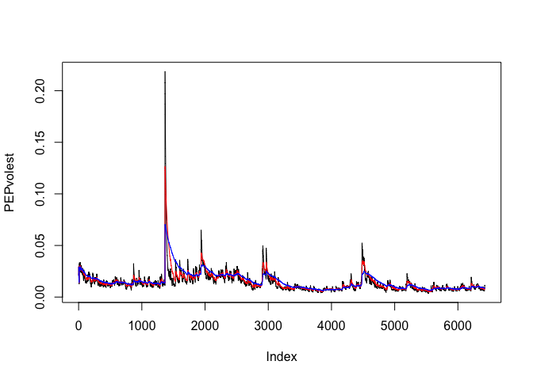

In this file using the code provided in the excersies I found a stock
that was less volitile than the example.

    library(tseries)

    ## Warning: package 'tseries' was built under R version 3.2.5

    PEPdata <- get.hist.quote('pep',quote="Close")

    ## time series ends   2016-07-01

    length(PEPdata)

    ## [1] 6426

    PEPret <- log(lag(PEPdata))-log(PEPdata)
    PEPvol <- sd(PEPret) * sqrt(250) * 100
    PEPvol 

    ## [1] 27.18801

    PEPVol <- function(d, logrets){ 
      var=0 
      lam= 0 
      varlist <- c() 
      for(r in logrets){
        lam = lam*(1 - 1/d) + 1
        var = (1-1/lam)*var + (1/lam)*r^2
        varlist <- c(varlist,var)} 
      sqrt(varlist)}

    PEPvolest <- PEPVol(10,PEPret)
    PEPvolest2 <- PEPVol(30,PEPret)
    PEPvolest3 <- PEPVol(100,PEPret)

    plot(PEPvolest, type="l")
    lines(PEPvolest2, type="l", col="red")
    lines(PEPvolest3, type="l", col="blue")

<!-- -->

    plot(PEPvolest, type="l")
    lines(PEPvolest2, type="l", col="red")
    lines(PEPvolest3, type="l", col="blue")

<!-- -->

Note that the `echo = FALSE` parameter was added to the code chunk to
prevent printing of the R code that generated the plot.
